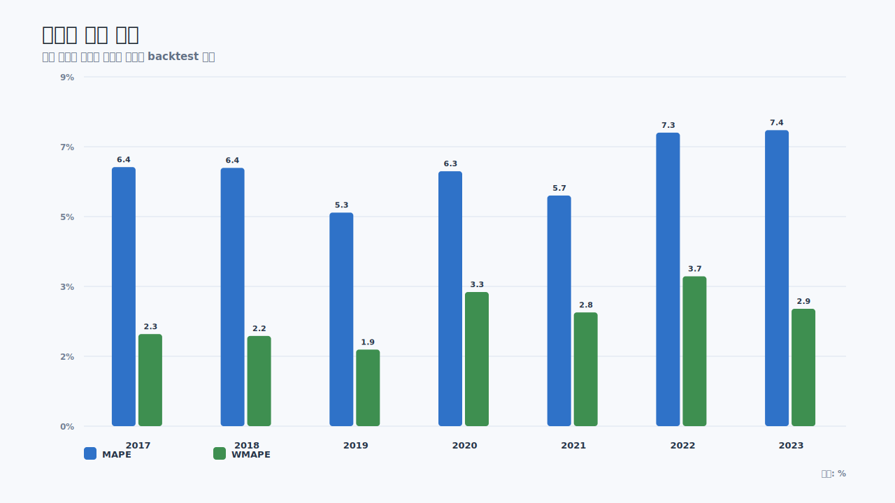
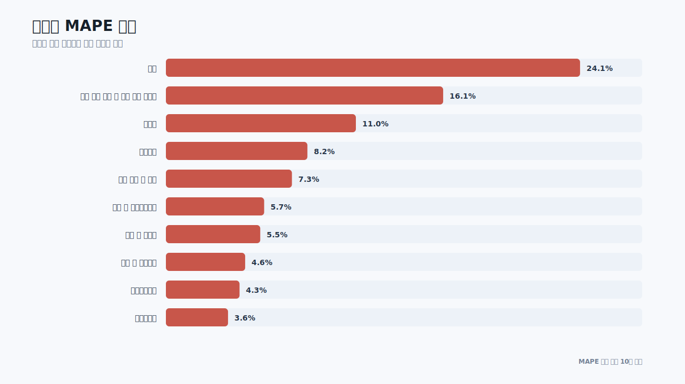
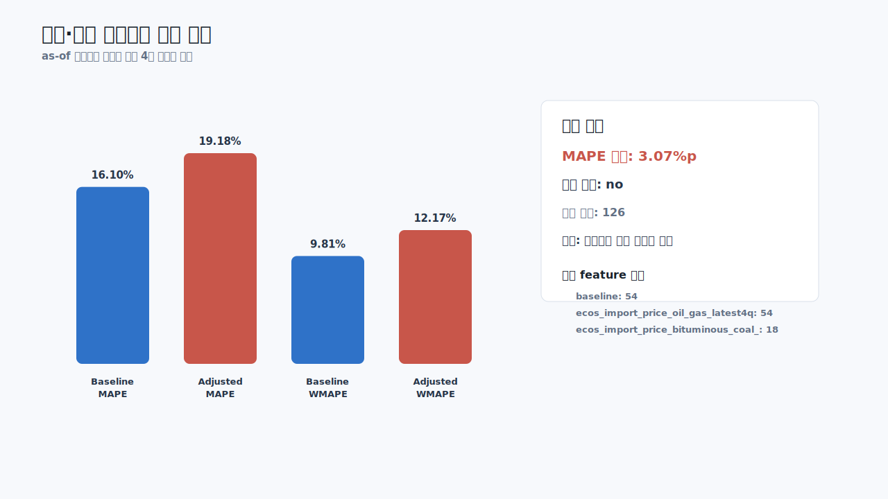

# 공표시점 기준 예측 오차 보고서

## 요약

이 보고서는 예측 시점에 이미 공표된 데이터만 사용했을 때의 예측값과 실제 공표값 차이를 정리한다. 사후에 알게 된 연간 proxy나 목표연도 전체 외생변수 평균은 사용하지 않는다.

- 전체 rolling backtest 비교 건수: `2,002`건
- 연도별 MAPE 평균: `6.41%`
- 전체 WMAPE: `2.76%`
- 전기·가스 외생변수 보정 채택 여부: `no`
- 상세산업 배분 총량 제약 최대 오차: `0.00000006`
- ECOS 실질 GDP와 KOSIS 실질 GDP 일치: `2,508`건
- 디플레이터 기준연도/표체계 차이로 분류: `648`건

## 적용 기준

예측 기준일은 연간 backtest의 경우 목표연도 1월 1일로 둔다. 분기 또는 연간 입력자료는 `관측기간 종료일 + 공표 지연 개월 수 < forecast_as_of` 조건을 만족할 때만 사용할 수 있다.

예를 들어 목표연도 2024년을 2024-01-01에 예측한다면, 1개월 지연 분기자료는 2023Q3까지 사용할 수 있고 2023Q4는 사용할 수 없다. 연간 proxy가 12개월 지연으로 공개된다고 보면, 2024년 예측에는 2022년 proxy까지만 사용할 수 있다.

## 연도별 오차

| 연도 | 비교 건수 | MAPE | WMAPE | 총량 오차율 |
| --- | --- | --- | --- | --- |
| 2017 | 286 | 6.43% | 2.29% | -0.044% |
| 2018 | 286 | 6.41% | 2.24% | 0.026% |
| 2019 | 286 | 5.30% | 1.90% | -0.441% |
| 2020 | 286 | 6.33% | 3.33% | 0.847% |
| 2021 | 286 | 5.73% | 2.82% | 1.487% |
| 2022 | 286 | 7.29% | 3.72% | 1.595% |
| 2023 | 286 | 7.35% | 2.91% | -0.859% |

연도별로 보면 MAPE는 2019년에 가장 낮고 2023년에 가장 높다. 다만 총량 오차율은 대체로 절대값 2% 내외에 머물러, 개별 지역·산업 조합의 오차가 서로 상쇄되는 경향이 있다.

## 산업별 오차

| 산업 | 비교 건수 | MAPE | WMAPE | 총량 오차율 |
| --- | --- | --- | --- | --- |
| 광업 | 112 | 24.06% | 8.69% | 0.224% |
| 전기 가스 증기 및 공기 조절 공급업 | 126 | 16.10% | 9.81% | -0.000% |
| 건설업 | 126 | 11.03% | 8.00% | 6.560% |
| 부동산업 | 126 | 8.22% | 4.24% | 3.650% |
| 농업 임업 및 어업 | 126 | 7.32% | 2.02% | 0.120% |
| 문화 및 기타서비스업 | 126 | 5.71% | 4.57% | 0.792% |
| 운수 및 창고업 | 126 | 5.48% | 3.43% | -1.135% |
| 숙박 및 음식점업 | 126 | 4.60% | 4.27% | -0.214% |
| 사업서비스업 | 126 | 4.28% | 1.88% | -0.665% |
| 정보통신업 | 126 | 3.61% | 1.66% | -0.118% |

산업별로는 광업과 전기·가스 부문 오차가 크다. 전기·가스는 총량 기준 오차율은 거의 0에 가까우나 지역별 분포 오차가 커서 MAPE와 WMAPE가 높다. 이 때문에 ECOS 가격·환율 변수를 붙여 보정 실험을 진행했다.

## 전기·가스 외생변수 보정 실험

| 지표 | 값 |
| --- | --- |
| Baseline MAPE | 16.10% |
| Adjusted MAPE | 19.18% |
| MAPE delta | 3.07%p |
| Baseline WMAPE | 9.81% |
| Adjusted WMAPE | 12.17% |
| Adopt | no |

보정 모델은 `energy_exogenous_with_ecos_quarterly.csv`의 FRED·ECOS 외생변수를 사용하되, 목표연도 1월 1일 현재 공표된 최신 4개 분기만 feature로 사용했다. 이 조건에서 보정 MAPE가 기준 MAPE보다 높아졌으므로 자동 보정 factor는 채택하지 않는다.

선택 feature 빈도:

| 선택 feature | 건수 |
| --- | --- |
| baseline | 54 |
| ecos_import_price_oil_gas_latest4q_level | 54 |
| ecos_import_price_bituminous_coal_latest4q_level | 18 |

## 공표 지연 적용 테이블

| 지표 | 출처 | 주기 | 공표 지연(월) | 적용 규칙 |
| --- | --- | --- | --- | --- |
| coal_australia_usd | FRED | Q | 1 | Use latest four quarters whose period_end + lag is before forecast origin; compare with prior four available quarters for yoy features. |
| ecos_import_price_bituminous_coal | ECOS | Q | 1 | Use latest four quarters whose period_end + lag is before forecast origin; compare with prior four available quarters for yoy features. |
| ecos_import_price_crude_oil | ECOS | Q | 1 | Use latest four quarters whose period_end + lag is before forecast origin; compare with prior four available quarters for yoy features. |
| ecos_import_price_lng | ECOS | Q | 1 | Use latest four quarters whose period_end + lag is before forecast origin; compare with prior four available quarters for yoy features. |
| ecos_import_price_lpg | ECOS | Q | 1 | Use latest four quarters whose period_end + lag is before forecast origin; compare with prior four available quarters for yoy features. |
| ecos_import_price_oil_gas | ECOS | Q | 1 | Use latest four quarters whose period_end + lag is before forecast origin; compare with prior four available quarters for yoy features. |
| ecos_import_price_total | ECOS | Q | 1 | Use latest four quarters whose period_end + lag is before forecast origin; compare with prior four available quarters for yoy features. |
| ecos_ppi_city_gas | ECOS | Q | 1 | Use latest four quarters whose period_end + lag is before forecast origin; compare with prior four available quarters for yoy features. |

현재 외생변수는 1개월 지연 분기자료로 처리했다. 실제 공식 공표 일정이 확인되는 항목은 이후 `publication_lag_months`를 더 세분화해 조정해야 한다.

## 상세산업 배분 검증

상세산업 추정은 연간 KSIC proxy가 목표연도 예측 기준일 전에 공표된 경우에만 사용한다. 또한 ECOS 산업연관표의 자기부문 부가가치유발계수를 구조 prior로 곱한 뒤, 시군구 제조업 총량에 다시 정규화한다.

| 항목 | 값 |
|---|---:|
| 상세산업 제약 진단 행 | 424 |
| 최대 총량 제약 오차 | 0.00000006 |
| 적용 방식 | lag-aware proxy × ECOS IO prior |

이 검증은 예측값이 실제 상세산업 GVA와 일치한다는 뜻이 아니다. 하위 상세산업 총합이 예측 기준의 시군구 제조업 총량과 일관되도록 유지된다는 회계 제약 검증이다.

## 해석

이번 결과는 두 가지를 보여준다.

1. 공표 시점을 엄격히 지키면 사용할 수 있는 정보량이 줄어들고, 사후 자료를 쓴 것처럼 성능이 좋아 보이지 않는다.
2. ECOS 외생변수와 산업연관표는 유용하지만, actual이 아니라 각각 `exogenous`와 `prior`로 다뤄야 한다.

따라서 현재 기준에서는 전기·가스 외생변수 자동 보정은 보류하고, 상세산업 배분에는 ECOS IO prior를 구조 가중치로 사용하는 것이 합리적이다.
